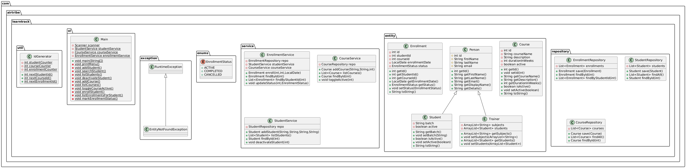

# Project Description

LearnTrack is a console-based Student & Course Management System built using Core Java.
`service/` contains business logic and storage, `entity/` holds data models, `util/` simple helper that holds the static variables as well as it's logic, `ui/` – Menu / Console UI (Main.java) and `exception/` contains custom exceptions.

# Setup Instructions

1. Install JDK 23 (or later).
2. Ensure `javac` and `java` are on your `PATH`.
3. Build with Maven from project root (requires Maven):

```cmd
mvn -B package
```

4. Run the application (after `mvn package`) with:

```cmd
java -cp target\learntrack-0.1.0.jar com.airtribe.learntrack.Main
```

If you don't have Maven, compile and run with `javac` and `java` directly by compiling `src/main/java` files.

_*Class Diagram:*_
