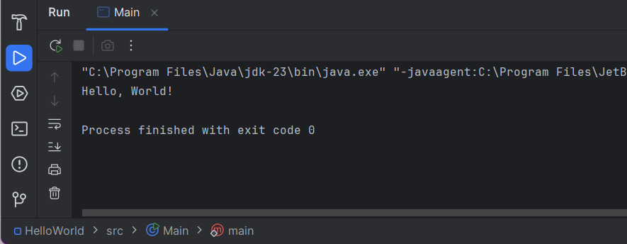

- JDK version 23 used

## Hello World Program in Java

```java
public class HelloWorld {
    public static void main(String[] args) {
        System.out.println("Hello, World!");
    }
}
```
Explanation:
- Class Declaration (HelloWorld): Defines the program structure. File name must match the class name.
- main() Method: Entry point where execution begins. public is the access modifier, static because the method belongs to the class not an object and void is the return type
- System.out.println(): Prints "Hello, World!" to the console.